# Socket Tester — User Guide

Socket Tester is a web-based tool for testing and monitoring real-time connections. You open it in a browser, connect to a server using one of four supported protocols, send messages, and watch the responses come back — all without writing a single line of code.

This guide walks through every part of the interface with screenshots.

---

## Table of Contents

- [Opening the Application](#opening-the-application)
- [The Interface at a Glance](#the-interface-at-a-glance)
- [Creating Your First Connection](#creating-your-first-connection)
  - [WebSocket](#websocket)
  - [Socket.IO](#socketio)
  - [MQTT](#mqtt)
- [Sending and Receiving Messages](#sending-and-receiving-messages)
- [Working with Multiple Connections](#working-with-multiple-connections)
- [Viewing Statistics](#viewing-statistics)
- [Viewing Logs](#viewing-logs)
- [Performance Testing](#performance-testing)
- [Network Condition Simulation](#network-condition-simulation)
- [Saving and Reusing Configurations](#saving-and-reusing-configurations)
- [The Command Palette](#the-command-palette)
- [Built-in Documentation](#built-in-documentation)
- [Keyboard Shortcuts](#keyboard-shortcuts)

---

## Opening the Application

If you are running Socket Tester locally, open your browser and go to:

```
http://localhost:3000
```

If someone has deployed it for your team, use the URL they provided.

---

## The Interface at a Glance

When you first open the application, you see three main areas:

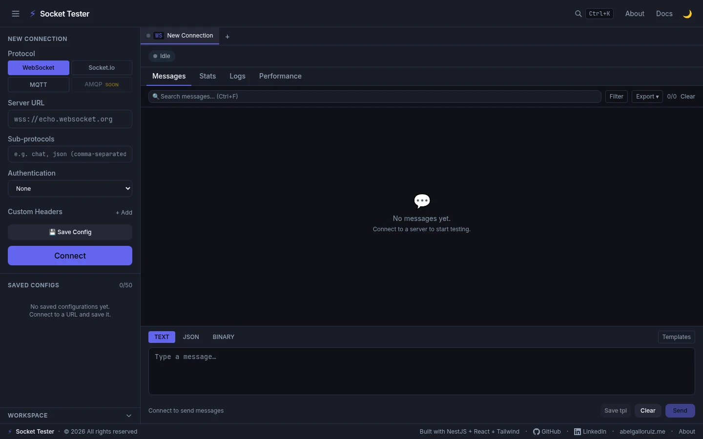

| Area | What it does |
|---|---|
| **Left sidebar** | Choose a protocol, fill in connection settings, save configs |
| **Tab bar** (top center) | One tab per connection; open up to 10 at the same time |
| **Main panel** | Four tabs — Messages, Stats, Logs, Performance |
| **Message composer** (bottom) | Type and send messages to the connected server |

The status indicator next to the tab name shows the connection state:
- Grey dot — Idle (not connected)
- Yellow dot — Connecting
- Green dot — Connected
- Red dot — Error or disconnected

---

## Creating Your First Connection

### WebSocket

WebSocket is the most common protocol for real-time communication. Use URLs that start with `ws://` (plain) or `wss://` (secure).

1. Select **WebSocket** in the sidebar (it is selected by default).
2. Type the server URL in the **Server URL** field. For a quick test you can use `wss://echo.websocket.org` or, if you are running the companion echo server locally, `ws://localhost:4500`.
3. Optionally fill in **Sub-protocols** (comma-separated, e.g. `chat, json`).
4. Optionally set **Authentication** — choose from Bearer Token, API Key, Basic Auth, or Custom Headers.
5. Click **Connect**.


When the connection is established, the button turns red and reads **Disconnect**, the status dot turns green, and the first message from the server appears in the message feed.

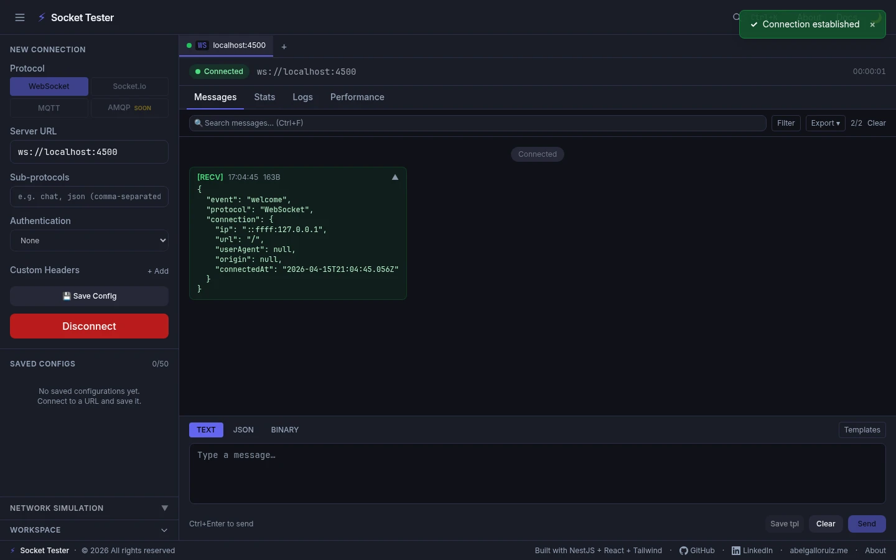

### Socket.IO

Socket.IO is a library that runs on top of WebSocket and adds features like rooms, events, and auto-reconnect.

1. Click **Socket.io** in the protocol selector.
2. Enter the server URL (usually `http://` or `https://`).
3. Optionally set the namespace (e.g. `/chat`), path, authentication payload, query parameters, and transport preference.
4. Click **Connect**.

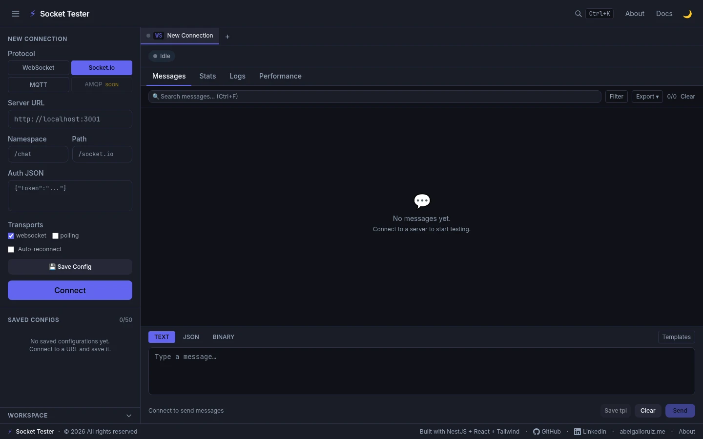

Once connected, you can subscribe to specific events by typing the event name and clicking **Subscribe**. All subscribed events will appear in the message feed.

### MQTT

MQTT is a lightweight publish/subscribe protocol commonly used in IoT.

1. Click **MQTT** in the protocol selector.
2. Enter the broker URL. Examples:
   - `mqtt://localhost:1883` (TCP)
   - `ws://localhost:9001` (WebSocket transport)
3. Optionally set a Client ID, username, password, keep-alive interval, and Will (last-will-and-testament) message.
4. Click **Connect**.

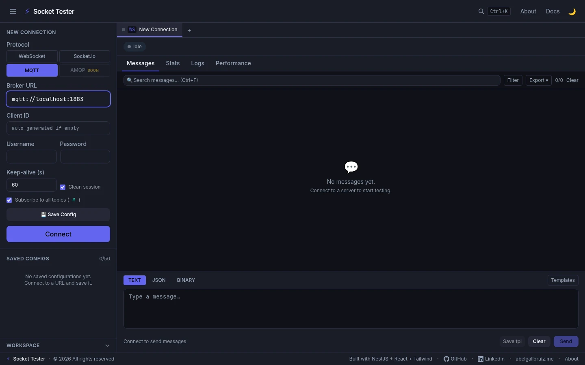

After connecting, use the **Publish** form to send a message to a topic, and use **Subscribe** to start receiving messages from a topic. You can subscribe to multiple topics at the same time.

---

## Sending and Receiving Messages

Once connected, the message composer appears at the bottom of the screen.

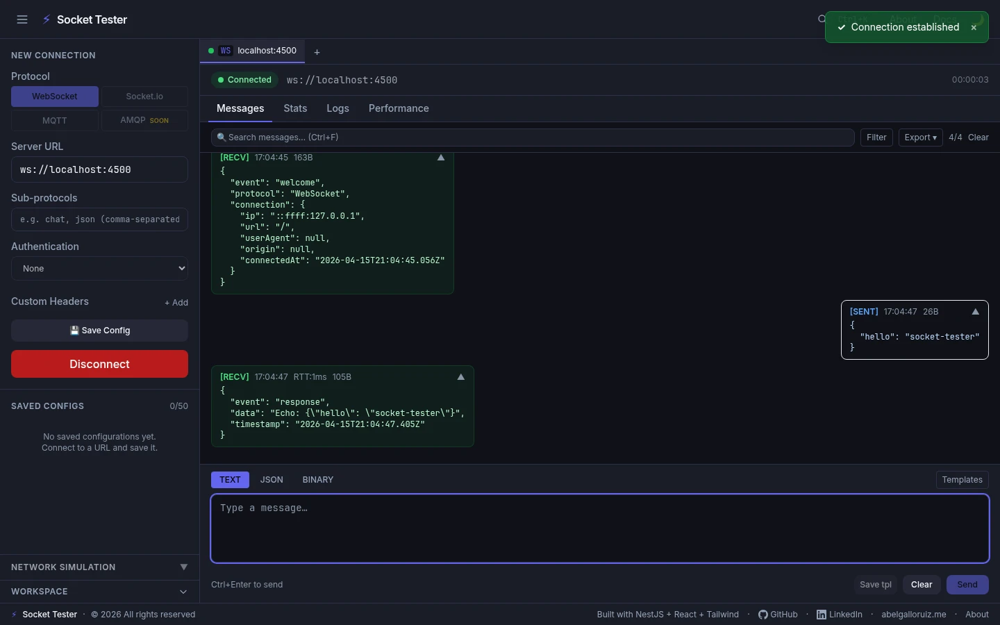

**To send a message:**

1. Click in the text area at the bottom.
2. Type your message. Switch between **TEXT**, **JSON**, and **BINARY** modes using the tabs above the composer.
   - In JSON mode, the input validates the JSON before sending.
3. Press `Ctrl+Enter` or click **Send**.

**Reading the message feed:**

- Messages on the **left** of the feed are received from the server (`[RECV]`).
- Messages on the **right** are messages you sent (`[SENT]`).
- Each message shows the timestamp, size in bytes, and RTT (round-trip time) for received responses.
- Click the arrow icon on a message to expand or collapse its content.

**Filtering and exporting:**

- Use the **Search messages** bar at the top to filter the message feed by text content.
- Click **Filter** to filter by direction (sent / received) or by message type.
- Click **Export** to download the message history as a JSON or CSV file.
- Click **Clear** to empty the message feed for the current connection.

---

## Working with Multiple Connections

You can open several connections at the same time, each in its own tab. This is useful for testing publisher and subscriber scenarios simultaneously.

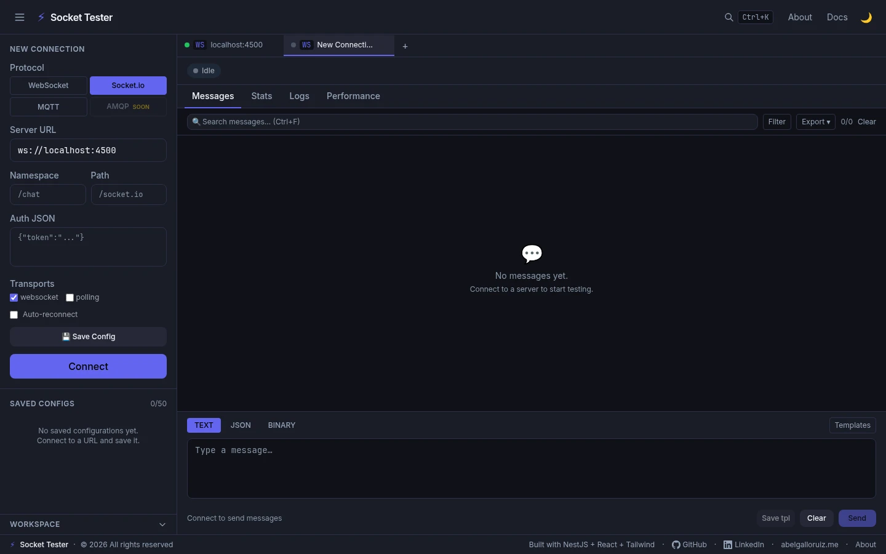

**To open a new tab:**

- Click the **+** button in the tab bar, or press `Ctrl+N`.
- Each new tab starts as idle and you can configure a completely different protocol and server.

**Switching tabs:**

- Click the tab by name, or press `Ctrl+1` through `Ctrl+9` to jump to a numbered tab.

**Closing a tab:**

- Click the **×** on a tab to close it. This also closes the underlying connection if it is active.

---

## Viewing Statistics

The **Stats** tab shows live metrics for the current connection.

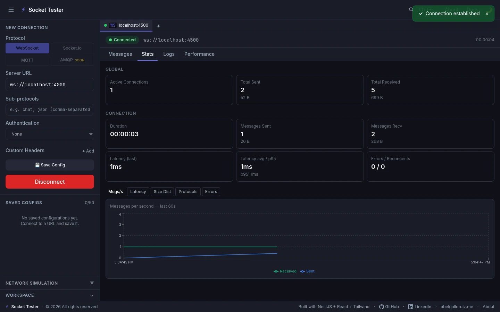

Charts update automatically while the connection is open:

- **Messages per second** — how many messages are being sent and received over time.
- **Latency trend** — round-trip time in milliseconds, with p95 and p99 percentile lines.
- **Error rate** — errors per minute.
- **Message sizes** — a histogram of payload sizes.

Under the charts you will see a summary row with total messages sent, total bytes, average latency, and error count.

---

## Viewing Logs

The **Logs** tab shows a structured event log for the connection lifecycle.

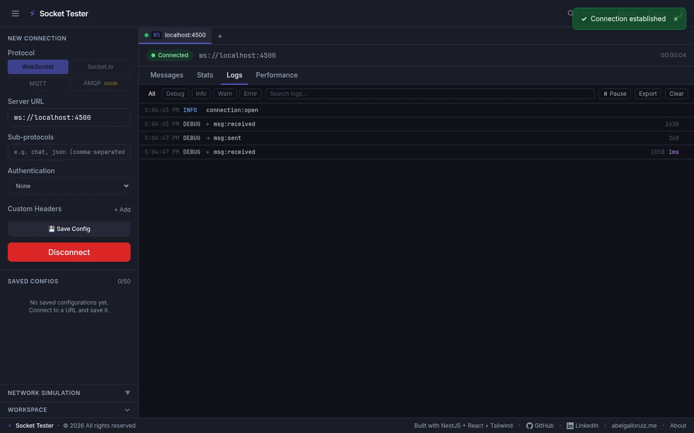

Each entry has a log level: `INFO`, `DEBUG`, `WARN`, or `ERROR`. Use the level filter dropdown to show only the entries you care about.

To export the full log as an NDJSON file (one JSON object per line), click **Export** in the Logs panel header.

To clear the log, click **Clear**.

---

## Performance Testing

The **Performance** tab lets you run automated latency and throughput tests against the connected server.

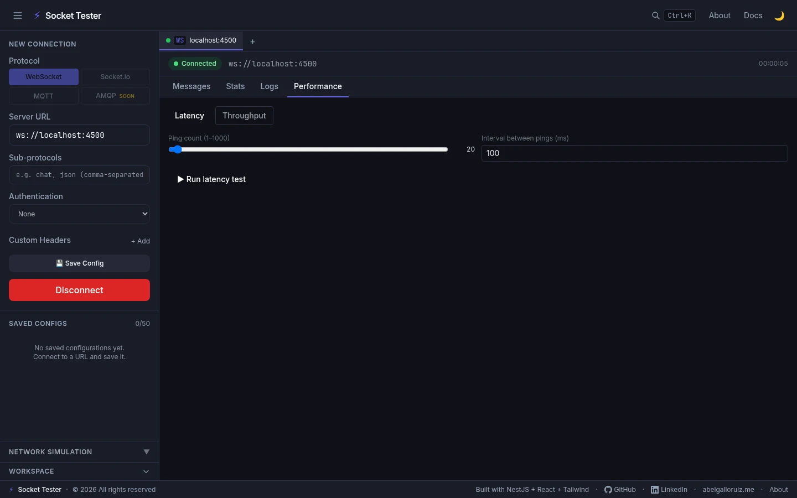

**Latency test:**

1. Set the number of messages to send (1–1000) and the interval between them (10–5000 ms).
2. Click **Start Latency Test**.
3. Wait for the test to complete. Results show: min, max, avg, p95, p99 RTT in milliseconds, and a histogram.

**Throughput test:**

1. Set messages per second (1–1000), duration in seconds (1–60), and payload size in bytes (1–65536).
2. Click **Start Throughput Test**.
3. Results show: target rate vs. actual rate, total messages sent and received, and a latency distribution.

You can abort a running test at any time by clicking **Abort**.

Past test results are stored and can be reviewed by clicking the result in the history list.

---

## Network Condition Simulation

When you are connected, the **NETWORK SIMULATION** section appears at the bottom of the left sidebar. Expand it to apply artificial network impairments.

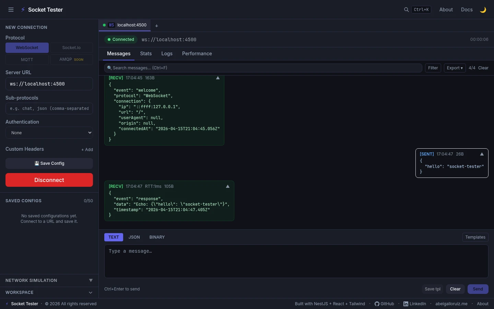

| Preset | What it does |
|---|---|
| **Slow 3G** | Adds latency and bandwidth limits typical of a 3G mobile connection |
| **Flapping** | Disconnects and reconnects repeatedly at a fixed interval |
| **High Latency** | Adds 500 ms of artificial delay to every message |
| **Lossy** | Randomly drops a percentage of messages |

You can also enter custom values:

- **Delay (ms)** — fixed one-way latency to add to each outbound message.
- **Jitter (ms)** — random variance around the delay value.
- **Disconnect after (ms)** — force-close the connection after this time (0 = off).
- **Flap interval (ms)** — repeatedly disconnect and reconnect every N milliseconds.

Network conditions are applied on the server side, so they affect the actual proxy connection, not just the display.

---

## Saving and Reusing Configurations

To avoid re-typing connection details, save them using the **Save Config** button.

1. Fill in the connection details in the sidebar.
2. Click **Save Config**.
3. The configuration appears in the **SAVED CONFIGS** list under the connection form.

To load a saved config, click its name in the list. The form is populated with the saved values, and you can connect immediately.

Saved configs are stored locally in your browser and persist across sessions (up to 50 configs).

**Sharing a config with someone else:**

Use the share feature to generate a token that encodes the configuration. The recipient opens the share URL and the form is pre-filled. Credentials (passwords, tokens) are automatically stripped from shared configs for security.

---

## The Command Palette

Press `Ctrl+K` anywhere in the application to open the command palette.

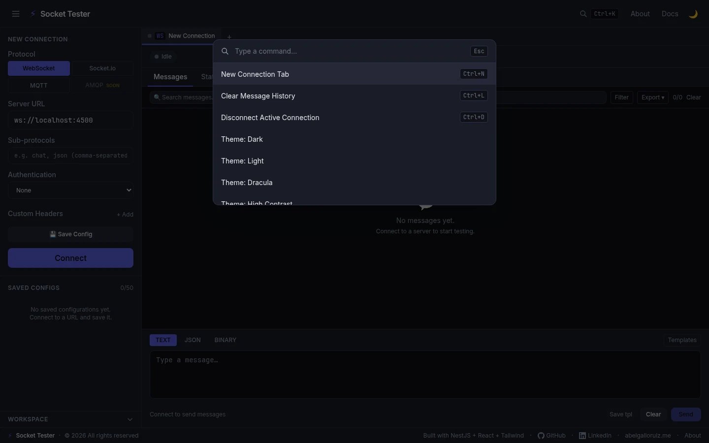

Type to search for any action. Available commands include:

- **New Connection Tab** — opens a new tab
- **Clear Message History** — clears the current tab's message feed
- **Disconnect Active Connection** — closes the proxy connection on the active tab
- **Theme: Dark / Light / Dracula / High Contrast** — switch the color theme instantly

Press `Esc` to close the palette without taking any action.

---

## Built-in Documentation

Click **Docs** in the top navigation bar to open the built-in documentation page.

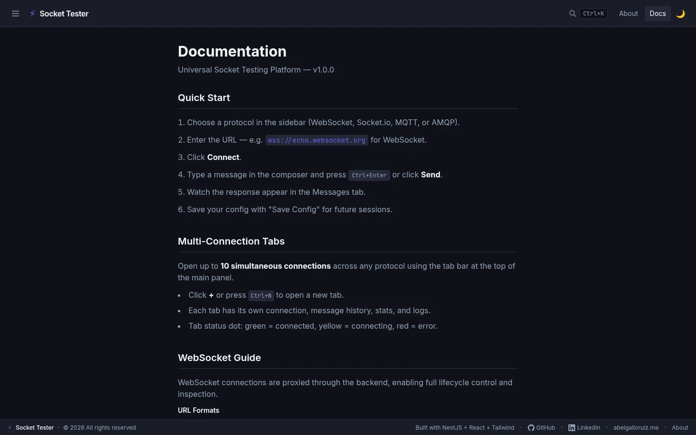

The docs page contains:

- Quick start steps for each protocol
- URL format examples
- Authentication setup guide
- Instructions for using network simulation
- Keyboard shortcut reference
- Explanation of the sharing feature

---

## Keyboard Shortcuts

| Shortcut | Action |
|---|---|
| `Ctrl+Enter` | Send the message in the composer |
| `Ctrl+K` | Open the command palette |
| `Ctrl+N` | Open a new connection tab |
| `Ctrl+L` | Clear message history on the active tab |
| `Ctrl+D` | Disconnect the active connection |
| `Ctrl+F` | Focus the message search bar |
| `Ctrl+S` | Save the current connection config |
| `Ctrl+E` | Export the message history |
| `Ctrl+1` – `Ctrl+4` | Switch between Messages / Stats / Logs / Performance tabs |
| `F1` | Open the Docs page |
| `Esc` | Close any open modal or the command palette |
